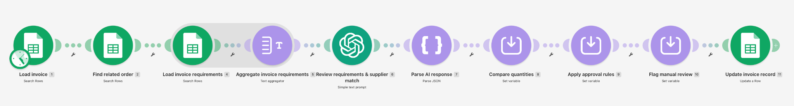
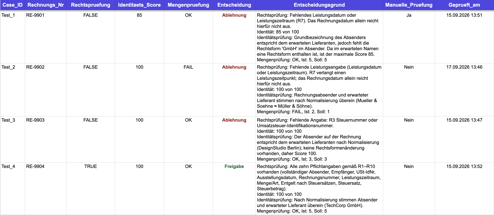

# Invoice Compliance Automation

A Make workflow that checks invoice records against a defined rule set, compares them with the related order, and writes the decision back to Google Sheets.

Import `invoice-review-automation.blueprint.json` into Make, connect your own accounts, and use the included sample data to test it.

> **A quick note on the setup.** This version starts with invoice text already stored in Google Sheets. It was built for a German invoice review scenario, so the original sheet names, field names, and result values remain in German. In a live setup, PDF extraction would sit in front of the current review flow.

## The Problem

An invoice can look complete and still be wrong for the order behind it.

Someone has to check whether the required details are present, whether the sender matches the expected supplier, and whether the invoiced quantity matches the order. Those checks do not all belong in the same kind of logic. Text needs interpretation. Quantities and approval thresholds do not.

This workflow brings the checks into one review path without handing the final decision to the language model.

## The Workflow

1. Load an invoice from the `Rechnungen` sheet.
2. Find the related order through its order ID.
3. Load ten invoice requirements from the `Rechtsregeln` sheet and combine them into one text block.
4. Ask OpenAI to check the required details and compare the invoice sender with the expected supplier.
5. Parse the response into `legal_ok`, `legal_reason`, `identity_score`, and `identity_reason`.
6. Compare invoiced and ordered quantities directly in Make.
7. Apply the approval rules and flag low identity scores for manual review.
8. Write the result, explanation, and timestamp back to the same invoice row.

## Design Decisions

The OpenAI call is not the decision-maker here. The main design choice was deciding what the model should read and what Make should control.

**Let the model read, not approve.** OpenAI checks whether the invoice text covers the required information and whether two supplier names still match after common spelling differences. It returns evidence for the next steps, not the final approval.

**Keep exact checks in Make.** Quantity comparison, the identity threshold, the manual review flag, and the final decision all use fixed Make logic. A model is unnecessary for `5 = 5` and should not decide whether that comparison passed.

**Require all three checks.** An invoice is approved only when the requirements check returns `true`, the identity score is at least `90`, and the quantity result is `OK`. If one of them fails, the result is `Ablehnung`.

**Send the rules once.** The ten rows from the rules sheet are aggregated before the OpenAI module. That keeps the review to one model call per invoice instead of ten.

**Use structured output.** The model returns JSON rather than a free-form answer. Make can parse the result into separate fields and use them without trying to interpret another block of text.

**Keep manual review visible.** A score below 90 sets `Manuelle_Pruefung` to `Ja`. The invoice is still rejected, but the reason for human follow-up stays visible in its own field.

## Tested Scenarios

I tested four invoice records designed to cover different outcomes.

| Invoice | What the test covers | Decision | Manual review |
| --- | --- | --- | --- |
| `RE-9901` | Missing service period and missing supplier legal form | `Ablehnung` | `Ja` |
| `RE-9902` | Missing service period and quantity mismatch | `Ablehnung` | `Nein` |
| `RE-9903` | Missing tax or VAT identification number | `Ablehnung` | `Nein` |
| `RE-9904` | Requirements, supplier, and quantity all match | `Freigabe` | `Nein` |

The records behind these tests are included in `sample-data`:

* `sample-invoices.csv`
* `sample-orders.csv`
* `compliance-rules.csv`

## Setup

1. **Prepare Google Sheets.** Import the three CSV files as separate tabs. Keep the original German tab names `Rechnungen`, `Auftraege`, and `Rechtsregeln`, because the blueprint references them directly.
2. **Import the blueprint.** In Make, create a scenario and import `invoice-review-automation.blueprint.json`.
3. **Add your connections.** Connect your own Google Sheets and OpenAI accounts.
4. **Set the spreadsheet.** Replace `YOUR_SPREADSHEET_ID` with the ID of your Google Sheet.
5. **Choose a test case.** Replace `TEST_CASE_ID` with a sample ID such as `Test_4`, then run the scenario once.

## Possible Extensions

The rules live in their own sheet, so the checklist can be changed without rewriting the whole scenario. The identity threshold and approval conditions sit in separate Make modules and can be adjusted independently.

For a live process, the first module could search for new, unreviewed invoices instead of a selected test case. PDFs could come straight from an inbox or shared drive. The text would be extracted first, with OCR for scanned documents, and then passed into the checks already built here.

## Scope

This version focuses on the review itself. It does not extract invoice data from PDFs or post approved invoices to an accounting system, and it is not intended as a legal or accounting control.

A production version would also need duplicate prevention, error handling, access controls, and monitoring. The compliance rules included here are simplified demo data for the project scenario.

## Status

Tested with four demo scenarios, including one approval path and three different rejection paths.
